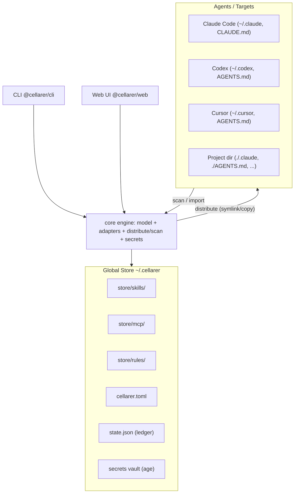
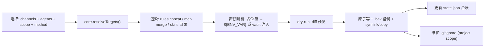
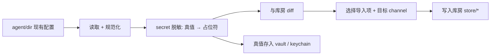

# cellarer 项目初始启动文档

> 一句话定位:cellarer 是面向"一台机器上多个 AI agent(Claude Code / Codex / Cursor 等)"的 **skills / MCP / rules 全局统一管理工具** —— 在中央"库房"维护一份真源,按需下发到任意 agent,并能反向扫描回收,内置通用/内网场景分治与密钥安全防护。

| 项 | 值 |
| --- | --- |
| 项目代号 | cellarer(修道院"司库/库房管理员"隐喻) |
| 文档类型 | 项目初始启动文档(Project Kickoff) |
| 版本 | Draft v0.1 |
| 最后更新 | 2026-06-30 |
| 适用范围 | v1:配置管理 + 下发 + 扫描回写 + 本地 Web UI |
| 仓库状态 | greenfield(空仓,`main` 分支) |

## 目录

- [1. 已确认关键决策](#1-已确认关键决策)
- [2. 背景与问题](#2-背景与问题)
- [3. 目标与非目标](#3-目标与非目标)
- [4. 核心概念与术语](#4-核心概念与术语)
- [5. 参考项目对标](#5-参考项目对标)
- [6. 总体架构](#6-总体架构)
- [7. 库房数据模型](#7-库房数据模型)
- [8. 下发设计](#8-下发设计)
- [9. 扫描回写设计](#9-扫描回写设计)
- [10. 密钥分层策略](#10-密钥分层策略)
- [11. 跨平台软链支持](#11-跨平台软链支持)
- [12. Web UI 设计](#12-web-ui-设计)
- [13. CLI 命令面](#13-cli-命令面)
- [14. 里程碑](#14-里程碑)
- [15. 风险与开放问题](#15-风险与开放问题)
- [16. 附录与参考链接](#16-附录与参考链接)

## 1. 已确认关键决策

本节为决策摘要(TL;DR),已与需求方确认,作为后续所有设计的前提:

1. **项目边界:纯配置管理工具**。cellarer 负责 skills/mcp/rules 的**全局维护 + 下发 + 扫描回写 + 可视化**,**不做** MCP 运行时代理/聚合网关。对标 `ruler` + `vercel-labs/skills` + `mcpm` 的 client/import 能力;`metamcp`/`1mcp` 的运行时方向仅作为 v2 备选,不在 v1 范围。
2. **技术栈:TypeScript monorepo**(pnpm + Turborepo)。`@cellarer/core` 共享库承载全部能力,`@cellarer/cli` 与 `@cellarer/web`(本地 Web UI)均为薄壳。理由:与主流 agent 生态(ruler/skills/metamcp/1mcp 均为 TS)一致,`npx` 分发顺畅,软链与配置解析生态成熟。
3. **密钥策略:分层防护**。库房只存占位符;下发时默认写 `${ENV_VAR}` 引用(对标 metamcp),可选 age 加密 vault(对标 spyrae/agentsync)与系统 keychain;下发文件**绝不写明文**,并自动维护 `.gitignore` 防误提交。

## 2. 背景与问题

开发者机器上通常同时存在多个 AI coding agent(Claude Code、Codex、Cursor、Windsurf、Gemini CLI……)。每个 agent 都各自维护自己的:

- **rules**:`AGENTS.md` / `CLAUDE.md` / `.cursor/rules/` 等项目或全局指令文件;
- **MCP**:`.mcp.json` / `.cursor/mcp.json` / `.codex/config.toml` / `~/.claude.json` 等格式各异的服务器配置;
- **skills**:`.claude/skills/` / `.agents/skills/` / `.cursor/skills/` 等目录。

由此带来的痛点:

- **重复维护**:同一条规则、同一个 MCP server、同一个 skill,要在多个 agent 的多个文件里各写一份,改一处要同步多处。
- **配置漂移**:多份副本随时间各自演化,逐渐不一致,难以判断"哪份才是对的"。
- **密钥泄露面大**:MCP 配置里的 API key 往往**明文**散落在多个文件中,数量随 agent 数线性放大,且极易被误提交到 git。
- **缺少场景分治**:"通用规则/工具"和"公司内网专用规则/工具"混在一起,无法按场景选择性下发。
- **现有工具各管一段**:`ruler` 偏 rules+mcp 的单向分发,`vercel-labs/skills` 偏 skill 分发,`mcpm` 偏 mcp 管理与导入 —— 没有一个工具统一覆盖"全局库房 + 双向同步(下发/扫描)+ 可视化 + 密钥安全 + 场景分治"。

cellarer 的核心主张:**一处维护,处处下发;反向可收;场景可分;密钥可控。**

## 3. 目标与非目标

### 3.1 v1 目标

- **全局统一管理**:在中央库房单一真源维护 skills / mcp / rules。
- **可视化**:本地 Web UI 浏览、编辑、打标、下发、扫描。
- **可下发**:库房 → `全局` / `指定 agent` / `指定目录` 三种范围,支持 `symlink`(默认)与 `copy` 两种方式,可按 channel 过滤;下发选项对齐 `vercel-labs/skills`。
- **可扫描回写**:从某个/某些 agent 或目录,把现有 skills/mcp/rules 反向导入库房,导入时自动密钥脱敏。
- **场景分治**:用 channel(`common` 通用 / `internal` 内网 / 自定义)对制品分类治理。
- **密钥安全**:分层防护(占位符 / `${ENV_VAR}` / age vault / keychain),下发不落明文。
- **跨平台**:macOS / Linux / Windows 软链兼容,失败可回退 copy。

### 3.2 非目标(v1 明确不做)

- ❌ **MCP 运行时代理 / 聚合网关**(metamcp / 1mcp 的方向)—— 不拦截、不聚合、不转发 MCP 流量。
- ❌ **云端托管 / 多人协作服务端** —— 本地优先,无中心服务、无数据库。
- ❌ **自建 skill 市场 / registry** —— 可对接外部 git/local 源,但不自建托管 registry。
- ❌ **agent 本身的安装 / 版本管理** —— 只管配置,不管 agent 生命周期。

## 4. 核心概念与术语

| 术语 | 英文 / 标识 | 含义 |
| --- | --- | --- |
| 库房 | Store | 全局唯一真源,默认位于 `~/.cellarer/`,集中存放 skills/mcp/rules 与配置、台账、密钥。 |
| 制品 | Artifact | 库房中的一个可分发单元:一个 skill(目录)、一个 mcp server 定义、或一个 rule 片段。 |
| 通道 | Channel | 制品的场景标签:`common`(通用)/ `internal`(公司内网)/ 自定义;下发时可按通道过滤。借鉴 `vercel-labs/skills` 的 `internal` flag 并泛化。 |
| 适配器 | Agent Adapter | 封装某个 agent 的路径与格式知识(rules 文件、mcp 配置、skills 目录、JSON/TOML/MD 转换)。分**内置**(代码)与**声明式自定义**(用户配置,见 6.6)两类,新增 agent 可零代码。 |
| 作用域 | Scope | 下发落点:`global`(写入 `~/.claude` 等家目录)/ `project`(写入某工程目录)。 |
| 下发 | Distribute / apply | 库房 → agent/目录 的推送。 |
| 扫描 | Scan / import | agent/目录 → 库房 的反向回收。 |
| 台账 | Ledger / State | 记录"下发到哪、symlink 还是 copy、checksum、时间",支撑 `revert` 与漂移检测。 |

## 5. 参考项目对标

| 项目 | 借鉴点 | cellarer 的取舍 |
| --- | --- | --- |
| [`intellectronica/ruler`](https://github.com/intellectronica/ruler) | 单一真源 `.ruler/` → 各 agent 原生文件分发;`ruler.toml` 配置;MCP `merge`/`overwrite` 策略;skills 拷贝;`.gitignore`/`.bak` 自动化;`apply`/`revert`;nested 规则 | 作为 rules+mcp+skills **分发引擎蓝本**;扩展为**双向**(增加 scan)+ channel 分治 + 密钥分层 |
| [`vercel-labs/skills`](https://github.com/vercel-labs/skills) | `add` 的 `symlink`(默认)/`copy`;`project`/`global` scope;`-a` 指定 agent;`internal` flag;70+ agent 路径对照表 | **下发选项与 agent 路径表蓝本**;`internal` flag 泛化为 channel |
| [`pathintegral-institute/mcpm.sh`](https://github.com/pathintegral-institute/mcpm.sh) | install-once 全局模型;profile;`client import`(从客户端导入);非交互模式 | **scan/回写** 与 profile/channel 蓝本;非交互模式对齐 |
| [`metatool-ai/metamcp`](https://github.com/metatool-ai/metamcp) | `${ENV_VAR}` 引用避免明文;Next.js Web UI;namespace 分组 | **密钥 env 引用蓝本**;Web UI 形态参考(但 cellarer 更轻量、无 DB) |
| [`1mcp-app/agent`](https://github.com/1mcp-app/agent) | 统一 runtime 聚合多 MCP server | 仅作 **v2 运行时方向**参考,v1 不实现 |
| `spyrae/agentsync` | age 加密 vault 管理密钥 | **密钥分层中的 vault 方案蓝本** |

## 6. 总体架构

### 6.1 设计原则

- **core-first**:全部能力沉淀在 `@cellarer/core`,CLI 与 Web 仅是壳。保证两端行为一致、便于测试。
- **声明式 + 台账**:下发是**幂等**的(声明目标状态而非命令式操作);台账(`state.json`)记录实际落地,支撑 `revert` 与漂移检测。
- **适配器化**:每个 agent 是一个 adapter,新增 agent = 新增一个文件,不改核心引擎。
- **安全默认**:默认不写明文密钥、默认 `.bak` 备份、默认友好支持 `--dry-run`。

### 6.2 架构总览图



### 6.3 monorepo 结构

```text
cellarer/
├── packages/
│   ├── core/                # @cellarer/core —— 全部能力的纯库
│   │   ├── src/
│   │   │   ├── model/       # Store / Artifact / Channel / Target 等类型
│   │   │   ├── adapters/    # AgentAdapter 接口 + 各 agent 实现 + registry + detect
│   │   │   ├── engine/      # distribute / scan / revert / status / diff
│   │   │   ├── secrets/     # resolver(env/vault/keychain)+ redactor + age vault
│   │   │   ├── store/       # 读写库房、cellarer.toml、state.json
│   │   │   └── fs/          # linkOrCopy 跨平台、原子写、backup
│   │   └── package.json
│   ├── cli/                 # @cellarer/cli —— commander 命令薄壳
│   └── web/                 # @cellarer/web —— React+Vite SPA + 内嵌 Hono server
├── docs/                    # 文档(本文件所在)
├── pnpm-workspace.yaml
├── turbo.json
├── tsconfig.base.json
└── package.json
```

### 6.4 分层与模块职责

- **`@cellarer/core`**:对外暴露 `distribute()` / `scan()` / `list()` / `revert()` / `status()` 等纯函数与适配器注册表;不依赖任何 UI/CLI 框架。
- **`@cellarer/cli`**:基于 `commander` 把命令映射到 core 调用;负责交互式选择、进度与彩色输出。
- **`@cellarer/web`**:内嵌 `Hono` server 把 core 暴露为本地 HTTP API(REST 或 tRPC),前端 React + Vite SPA 消费;**无 DB,直接读写库房文件**。

### 6.5 适配器层(AgentAdapter)

适配器是新增 agent 支持的扩展点,分两类、实现同一接口、由注册表统一加载(详见 6.6):**内置适配器**(代码,处理格式转换等复杂逻辑)与**声明式自定义适配器**(用户用配置定义,无需写代码)。接口草案:

```ts
// @cellarer/core/src/adapters/types.ts
type Scope = "global" | "project";
type LinkMethod = "symlink" | "copy";

interface AgentPaths {
  rules?: string;        // 例:CLAUDE.md / AGENTS.md / .cursor/rules/cellarer.md
  mcp?: string;          // 例:.mcp.json / .cursor/mcp.json / .codex/config.toml
  skillsDir?: string;    // 例:.claude/skills/ / .agents/skills/
}

interface AgentAdapter {
  id: string;            // 'claude-code' | 'codex' | 'cursor' | ...
  displayName: string;
  // 探测该 agent 在指定 scope/目录下是否存在
  detect(scope: Scope, dir?: string): Promise<{ installed: boolean; root: string }>;
  // 返回该 agent 在指定 scope/目录下的 rules/mcp/skills 路径
  paths(scope: Scope, dir?: string): AgentPaths;
  // 声明各能力在各 scope 下是否支持(不支持则下发时跳过并告警)
  capabilities: { rules: Scope[]; mcp: Scope[]; skills: Scope[] };
  // 编解码:把库房 canonical 形态 ↔ 该 agent 的原生格式
  rules?: RulesCodec;    // concat 写入 / 读取
  mcp?: McpCodec;        // JSON↔TOML、merge/overwrite
  skills?: SkillsCodec;  // 目录 link/copy / 反向枚举
}
```

**首批适配器路径对照(待落地实测校准)**:下表取自 `ruler` 与 `vercel-labs/skills` 两份资料的并集,部分路径在不同工具间存在分歧(已标注),实现时以本机实测为准。

| Agent | rules 文件 | mcp 配置(project / global) | skills 目录(project / global) |
| --- | --- | --- | --- |
| 通用 AGENTS.md | `AGENTS.md` | — | `.agents/skills/` / `~/.agents/skills/` |
| Claude Code | `CLAUDE.md`(global:`~/.claude/CLAUDE.md`) | `.mcp.json` / `~/.claude.json`(待校准) | `.claude/skills/` / `~/.claude/skills/` |
| Codex | `AGENTS.md`(global:`~/.codex/AGENTS.md`) | `.codex/config.toml` / `~/.codex/config.toml` | `.agents/skills/` / `~/.codex/skills/` |
| Cursor | `AGENTS.md` / `.cursor/rules/`(global 非文件化,见风险) | `.cursor/mcp.json` / `~/.cursor/mcp.json` | `.cursor/skills/` 或 `.agents/skills/`(分歧) / `~/.cursor/skills/` |

> 说明:`ruler` 记 Cursor skills 为 `.cursor/skills/`,而 `vercel-labs/skills` 记 project 为 `.agents/skills/`、global 为 `~/.cursor/skills/`。适配器将以"capability matrix + 实测"固化,差异点纳入快照测试(见[风险](#15-风险与开放问题))。

### 6.6 可配置适配器(用户自定义 agent)

内置适配器覆盖主流 agent;但新 agent 层出不穷,且各有一套目录/格式约定。为避免"每来一个新 agent 就要改代码、等发版",适配器层支持**声明式配置**:用户用一份配置即可定义一个全新 agent。

**两类适配器,同一接口、同一注册表:**

- **内置适配器(code)**:用于需要复杂逻辑的 agent(如 JSON↔TOML 转换、Cursor 全局 rules 非文件化等),随 cellarer 发布。
- **声明式自定义适配器(config)**:用户用 TOML/JSON 描述路径模板与格式,由 core 在运行时构造成 `AgentAdapter`,零代码。

**配置位置(可共享、可版本化,一文件一 agent,便于团队/社区直接拷贝分享):**

- 全局:`~/.cellarer/adapters/<id>.toml`
- 工程:`<project>/.cellarer/adapters/<id>.toml`
- 也可内联在 `cellarer.toml` 的 `[agents.custom.<id>]`

**加载与优先级**:注册表按 `内置 → 全局自定义 → 工程自定义` 合并,**后者覆盖前者同名 id**(因此自定义配置既能新增 agent,也能给内置适配器打补丁/修正路径)。

**声明式 schema 示例**(新增一个目录格式完全不同的 agent):

```toml
# ~/.cellarer/adapters/my-new-agent.toml
id = "my-new-agent"
displayName = "My New Agent"

# 探测:命中任一路径即视为已安装
[detect]
global = ["~/.mynewagent"]
project = [".mynewagent"]

# 路径模板:支持 ~(家目录)与 {dir}(工程根)占位符
[rules]
global = "~/.mynewagent/AGENTS.md"
project = "{dir}/.mynewagent/rules.md"
format = "markdown"             # markdown:多个 rule 片段 concat 写入

[mcp]
global = "~/.mynewagent/mcp.json"
project = "{dir}/.mynewagent/mcp.json"
format = "json"                 # json | toml
servers_key = "mcpServers"     # mcp server 列表所在的键路径(如 codex 用 toml + "mcp_servers")
merge_strategy = "merge"        # merge | overwrite

[skills]
global = "~/.mynewagent/skills"
project = "{dir}/.mynewagent/skills"
format = "dir"                  # 目录级 link/copy

# 能力声明:未列出的 scope 自动跳过并告警
capabilities = { rules = ["global", "project"], mcp = ["global", "project"], skills = ["project"] }
```

**能力边界与兜底**:声明式 schema 覆盖"路径模板 + 常见格式(markdown / json / toml)+ `servers_key` + merge 策略"这类绝大多数场景。若某 agent 格式过于特殊、需要非平凡转换,则:(1) 退回内置代码适配器;或 (2) 通过指向用户脚本的 `transform` 钩子自定义读写(列为 v2 候选,v1 暂不实现)。

**校验**:加载时校验 schema(必填 `id`、至少一条能力路径、路径模板合法、`format` 取值合法);不合法则跳过该自定义适配器并告警,不影响其余适配器。

## 7. 库房数据模型

### 7.1 库房目录布局

```text
~/.cellarer/
├── store/
│   ├── skills/<name>/SKILL.md      # skill 制品(可含附属脚本/文档)
│   ├── mcp/<name>.json             # MCP canonical 定义(密钥位写占位符)
│   └── rules/<name>.md             # rule 片段
├── cellarer.toml                   # 主配置:channel、制品标签、agent 覆盖、默认策略
├── adapters/<id>.toml              # 可选:用户自定义 agent 适配器(声明式,见 6.6)
├── state.json                      # 下发台账(target / method / checksum / 时间)
└── secrets/
    ├── vault.age                   # 可选:age 加密的密钥库
    └── refs.json                   # 引用名 → 来源(env/vault/keychain)映射(不含真值)
```

### 7.2 `cellarer.toml` 示例

```toml
# 默认下发策略
[defaults]
method = "symlink"          # symlink | copy
channels = ["common"]        # 不指定 --channel 时的默认通道
secret_mode = "env"          # env | vault | keychain

# 各操作系统默认覆盖(注意点 3:Windows 软链兜底)
[defaults.os.win32]
method = "copy"

# 通道定义
[channels.common]
description = "通用,适用于所有环境"
[channels.internal]
description = "公司内网专用,默认不下发到个人项目"

# 制品 → 通道标签
[artifacts."skills/frontend-design"]
channels = ["common"]
[artifacts."mcp/company-gateway"]
channels = ["internal"]

# 按 agent 覆盖(例:Cursor 全局 rules 不支持,跳过)
[agents.cursor]
enabled = true
[agents.codex.mcp]
merge_strategy = "merge"     # merge | overwrite
```

### 7.3 `state.json` 台账示例

```jsonc
{
  "version": 1,
  "entries": [
    {
      "artifact": "rules/coding-style",
      "agent": "claude-code",
      "scope": "global",
      "target": "/Users/me/.claude/CLAUDE.md",
      "method": "copy",            // 实际落地方式(软链失败回退会被记录)
      "checksum": "sha256:…",      // 用于漂移检测
      "backup": "/Users/me/.claude/CLAUDE.md.bak",
      "appliedAt": "2026-06-30T08:00:00Z"
    }
  ]
}
```

## 8. 下发设计

下发坐标是一个四元组:**channels × agents × scope × method**。

### 8.1 三种同步范围(对应注意点 1)

| 范围 | 标志 | 落点 | 说明 |
| --- | --- | --- | --- |
| 全局同步 | `--global` | 各 agent 家目录(`~/.claude`、`~/.codex`、`~/.cursor` 等) | 一次性把库房铺到本机所有/选定 agent 的全局配置 |
| 指定 agent 同步 | `--agent <ids...>` | 仅选中 agent | 如 `--agent claude-code,codex` |
| 指定目录同步 | `--dir <path>` | 某工程目录的 project 级配置(`./AGENTS.md`、`./.cursor/...`) | 针对单个仓库定制 |

三者**可叠加**:`cellarer apply --agent claude-code,cursor --dir ./repo --channel internal`。

### 8.2 下发方式与制品落地

- **`symlink`(默认)**:agent 路径软链到库房单一真源,改一处全更新(对标 `vercel-labs/skills` 的推荐方式)。
- **`copy`(`--copy`)**:独立拷贝;软链不可用、或需把生成文件提交到版本库时使用。
- 三类制品的落地策略:
  - **rules**:把选中 channel 的 rule 文件按序 concat → 写入 agent 原生 rules 文件(`AGENTS.md` / `CLAUDE.md` / `.cursor/...`);插入来源溯源标记(对标 ruler 的 source marker),便于扫描时识别"哪些是 cellarer 写的"。
  - **mcp**:与 agent 现有配置 `merge`(默认)或 `overwrite`;写前生成 `.bak`;按适配器做 JSON↔TOML 格式转换。
  - **skills**:目录级 `symlink`/`copy` 到 agent skills 目录。
- **安全护栏**:`--dry-run` 预览 diff;默认 `.bak` 备份;`project` scope 自动维护 `.gitignore` managed block(对标 ruler)。

### 8.3 下发数据流



### 8.4 幂等、回滚与漂移检测

- **幂等**:重复 `apply` 结果一致,可安全反复执行。
- **`cellarer revert`**:依据台账回滚 —— 恢复 `.bak`、删除生成文件、移除软链(只删链不删真源),对标 ruler `revert`。
- **`cellarer status`**:对比库房 vs 实际落地,报告漂移(被手改、软链断裂、checksum 不符等)。

### 8.5 下发优先级(冲突解决)

当同名制品/同一目标出现多来源时,确定性优先级(高 → 低,对标 ruler):

1. CLI flag(如 `--channel`、`--copy`、`--mcp-overwrite`)
2. agent 覆盖(`cellarer.toml` 的 `[agents.<id>]`)
3. channel 级配置
4. 全局默认(`[defaults]`)

## 9. 扫描回写设计

扫描(scan / import)是下发的逆向:把 agent/目录里已有的配置回收进库房,统一治理。

### 9.1 流程

- 触发:`cellarer scan --agent <id>` 或 `cellarer scan --dir <path>`。
- 步骤:读取目标现有 skills/mcp/rules → 规范化为 canonical 形态 → 与库房 `diff` → 交互/批量选择导入到指定 channel(默认 `common`;内网来源建议 `internal`)。
- 冲突:同名制品提供 `keep-mine` / `keep-theirs` / `新建副本(带来源后缀)` 三种策略。

### 9.2 密钥脱敏(对应注意点 2)

导入**前**对 mcp 的 `env` / `headers` 等字段做 secret 识别:

- **命名启发式**:`*_KEY` / `*_TOKEN` / `*_SECRET` / `Authorization` / `password` 等;
- **值模式**:`sk-…` / `ghp_…` / JWT / 长 base64 / 高熵字符串。

命中后:

1. 库房制品文件中替换为占位符 `${CELLARER_SECRET:<name>}`;
2. 真值提示存入 age vault 或系统 keychain;
3. **绝不**把真值写进库房制品文件或 git。

### 9.3 扫描数据流



## 10. 密钥分层策略

**威胁模型**:同步会把 API key 明文写到多个 agent 文件,泄露面随 agent 数线性放大,且极易被误提交到 git。cellarer 用分层防护把"真值落盘"压到最小。

### 10.1 四层防护(从默认到加强)

1. **占位符(库房层)**:库房制品文件**零明文**,密钥位写 `${CELLARER_SECRET:<name>}` 或 `${ENV_VAR}`。
2. **环境变量引用(下发默认,对标 metamcp)**:下发到 agent 配置时写 `${ENV_VAR}`,真值留在用户 shell / CI 环境,不落盘。适用于支持 env 引用的 agent。
3. **age 加密 vault(对标 spyrae/agentsync)**:对不支持 env 引用、必须明文的 agent,在下发时从 `~/.cellarer/secrets/vault.age` 解密后注入;vault 由 age 密钥/口令加密,密钥本身不入库、不进 git。
4. **系统 keychain(可选)**:macOS Keychain / Windows Credential Manager / Linux libsecret,作为 vault 的替代或补充。

### 10.2 选型决策

| 场景 | 推荐层 |
| --- | --- |
| agent 支持 `${ENV_VAR}` 引用 | 第 2 层(env 引用) |
| agent 必须明文、本机使用 | 第 3 层(age vault 解密注入)或第 4 层(keychain) |
| CI / 无人值守 | 第 2 层(env 注入) |
| 高安全 / 合规要求 | 第 4 层(keychain)+ 审计 |

### 10.3 护栏与审计

- **下发前 secret-scan**:若检测到明文会被写入 git 跟踪文件,则**中止**并提示。
- **`.gitignore` 自动纳管**:`project` scope 下生成文件自动加入 managed block。
- **`cellarer secret` 子命令**:`add` / `import` / `rotate` / `ls`(**只列名不列值**)/ `rm`。
- **审计**:台账只记录"某 target 使用了哪个密钥**引用名**",绝不记录真值。

## 11. 跨平台软链支持

对应注意点 3:软链在 Windows 上存在权限与类型差异,需统一抽象与兜底。

### 11.1 `linkOrCopy` 抽象

```ts
// @cellarer/core/src/fs/linkOrCopy.ts
async function linkOrCopy(
  src: string,
  dest: string,
  opts: { method: "symlink" | "copy"; kind: "file" | "dir" },
): Promise<{ method: "symlink" | "junction" | "copy" }>;
```

- **POSIX(macOS / Linux)**:`fs.symlink`(文件、目录均可)。
- **Windows**:
  - 目录:优先 `fs.symlink(src, dest, "junction")`(**junction 无需管理员权限**,最稳)。
  - 文件:尝试 `fs.symlink`(需 **Developer Mode** 或管理员权限),失败则回退 `copy` 并告警。
  - 探测 Developer Mode / 权限状态,给出明确开启指引。
- **统一回退**:任何软链失败都回退 `copy`,并把**实际 method 记入台账**(供 `status`/`revert` 正确处理)。

### 11.2 配置与健康检查

- `--copy` 强制拷贝;`cellarer.toml` 的 `[defaults.os.win32].method = "copy"` 可设 per-OS 默认(见 [7.2](#7-库房数据模型))。
- **软链健康检查**纳入 `cellarer status`:检测断链、指向错误的软链。
- **卸载/回滚**正确区分软链与拷贝:删链不删库房真源。

## 12. Web UI 设计

- **启动**:`cellarer ui [--port]` → 打开本地 `http://localhost:PORT`,默认仅监听 `127.0.0.1`。
- **技术**:React + Vite SPA;内嵌 `Hono` server 把 core 暴露为本地 HTTP API(REST 或 tRPC);**单进程、无 DB**,直接读写库房文件。
- **页面**:

| 页面 | 功能 |
| --- | --- |
| Dashboard | 检测到的 agents、各 scope 下发状态、漂移告警一览 |
| Skills / MCP / Rules | 浏览/编辑库房制品,打 channel 标签 |
| Distribute | `item × agent × scope × method` 矩阵选择 → diff 预览 → apply |
| Scan | 选 agent/目录 → 预览(含脱敏)→ 选择导入 channel |
| Secrets | vault 管理(**只显示引用名,值掩码**) |
| Settings | 默认 method、默认 channel、per-OS 策略、port |

- **安全**:本地回环监听;可选访问 token;前端**不明文回显**密钥。

## 13. CLI 命令面

命令与标志刻意对齐 `ruler` / `vercel-labs/skills`,降低用户迁移成本。

| 命令 | 说明 | 关键标志 |
| --- | --- | --- |
| `cellarer init` | 初始化库房(全局)或当前工程 | `--global` / `--project` |
| `cellarer add <source>` | 从 git/local 源导入制品到库房 | 源格式对齐 skills:`owner/repo`、URL、本地路径 |
| `cellarer ls` | 列出库房制品与下发分布 | `--channel` / `--agent` |
| `cellarer apply` | 下发(= distribute) | `--global` / `--agent` / `--dir` / `--channel` / `--skills` / `--mcp` / `--rules` / `--copy` / `--dry-run` / `--yes` / `--list` |
| `cellarer scan` | 扫描回写(= import) | `--agent` / `--dir` / `--into-channel` / `--dry-run` |
| `cellarer status` | 漂移检测(库房 vs 落地) | `--agent` / `--dir` |
| `cellarer revert` | 依据台账回滚下发 | `--agent` / `--dir` / `--keep-backups` |
| `cellarer secret` | 密钥管理 | `add` / `import` / `rotate` / `ls` / `rm` |
| `cellarer ui` | 启动本地 Web UI | `--port` |

非交互模式(CI 友好):提供 `--yes` 与环境变量(如 `CELLARER_NON_INTERACTIVE=1`、`CELLARER_JSON=1`),对标 mcpm 的自动化能力。

## 14. 里程碑

建议先做 **walking skeleton(tracer bullet)**:打通 M0 + M1 中"单个 rule 制品 → 单个 agent → `--dry-run` → `apply` → `revert`"的最小闭环,验证架构再横向扩展。

| 里程碑 | 内容 | 验收标准 |
| --- | --- | --- |
| **M0 脚手架** | pnpm + Turborepo monorepo;`@cellarer/core` 类型与 `AgentAdapter` 接口;空 CLI/Web 壳;CI | `pnpm build` / `pnpm test` 通过,空命令可运行 |
| **M1 rules 下发闭环** | Claude Code / Codex / Cursor + 通用 AGENTS.md;**适配器注册表支持内置 + 声明式自定义(`~/.cellarer/adapters/*.toml`)**;symlink/copy;`.bak`;`.gitignore`;台账;`apply`/`revert`/`status`;`--dry-run` | 单 rule 可下发到 3 agent 并完整回滚;能用一份配置接入一个自定义 agent |
| **M2 mcp + skills 下发** | mcp merge/overwrite;skills 目录链接;channel(common/internal);密钥分层(env ref + age vault);secret-scan 护栏 | 含密钥的 mcp 下发后磁盘**无明文**;按 channel 过滤生效 |
| **M3 扫描回写** | agent/dir import;密钥脱敏;冲突策略 | 从 agent 扫描导入库房,密钥被自动替换为占位符 |
| **M4 Web UI** | Dashboard / Distribute / Scan / Secrets 页面 | 可视化完成一次下发与一次扫描 |
| **M5 打磨与扩展** | 更多内置 agent 适配器 + 自定义适配器示例库/编写文档;Windows 加固;`npx cellarer` 打包发布;CI 漂移检查 action;文档站 | Windows 实测通过;发布到 npm 可 `npx` 运行 |

## 15. 风险与开放问题

### 15.1 风险与缓解

| 风险 | 缓解 |
| --- | --- |
| agent 配置格式/路径频繁变更;新 agent 不断涌现 | 适配器版本化 + 快照测试;**声明式自定义适配器**(见 6.6)让用户自助新增/修正 agent,无需等待发版;首批路径表标注"待校准",实现时本机实测 |
| Cursor 全局 rules 非文件化(存于应用设置 DB) | 适配器声明 capability,缺失的 scope 下发时跳过并告警 |
| Windows 软链权限 | 默认 `copy` 兜底可配置(`[defaults.os.win32]`);junction 优先 |
| 密钥识别漏报/误报 | 命名 + 值模式双启发式 + 下发前兜底 secret-scan + 人工确认;不追求 100% 自动 |
| mcp merge 冲突 / 多源 channel 优先级 | 确定性优先级:CLI > agent 覆盖 > channel > 全局默认(见 [8.5](#8-下发设计)) |
| worktree 下 gitignore 文件不复制 | 提供"提交生成文件"模式(对标 ruler scenario 2) |

### 15.2 开放问题(待决)

- 库房是否需要 **git 版本化 / 多机同步**?(v1 暂本地,预留 hook)
- channel 之外是否需要 **profile**(组合下发预设,如"前端工作流 = 若干 skills + mcp")?
- `cellarer add` 是否直接对接**远程 registry**(如 skills.sh)?
- 是否需要 **watch 模式**(库房变更自动 re-apply)?

## 16. 附录与参考链接

- ruler:<https://github.com/intellectronica/ruler>
- vercel-labs/skills:<https://github.com/vercel-labs/skills>
- mcpm.sh:<https://github.com/pathintegral-institute/mcpm.sh>
- metamcp:<https://github.com/metatool-ai/metamcp>
- 1mcp-app/agent:<https://github.com/1mcp-app/agent>
- spyrae/agentsync(age vault 思路参考)
- Agent Skills 规范:<https://agentskills.io>

